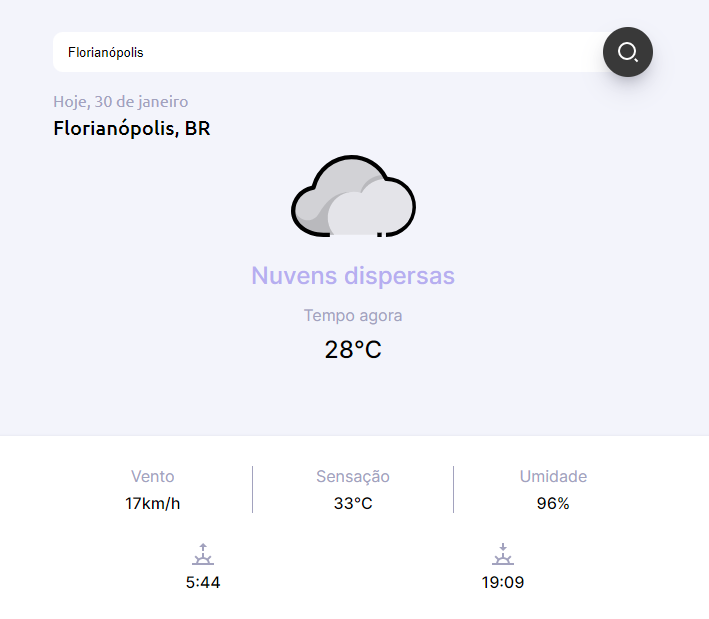

<h1 align="center"> SnapClima </h1>

    Aplicação para consultar a <strong>condição climática</strong> da sua região em tempo real via <strong>API</strong>.

    

## 📚 Tecnologias Utilizadas

Esse projeto foi desenvolvido com as seguintes tecnologias:

- HTML e CSS
- JavaScript
- Git e Github
- Weather API 

## 📡 O PROJETO

    A aplicação utiliza a API forrnecida gratuitamente pela plataforma <strong>OpenWeather.</strong>

O projeto permite o usuário consultar em tempo real informações meteorológicas à partir da sua geolocalização. Além disso, há a opção de buscar manualmente, por meio de barra de pesquisa, por essas informações de qualquer cidade do planeta.

Ao acessar a aplicação pela primeira vez, o sistema solicitará permissão da localização do usuário. Caso o usuário permita, a informação (latitude e longitude) é utilizada pelo programa que faz um <strong>_request_</strong> à API e tem como <strong>_response_</strong> uma série de informações. 

Caso contrário, o usuário deve digitar a informação na barra de pesquisa, a qual é um input, e o pragrama identifica o <strong>_value_</strong> do elemento e realiza o _request_ pelo nome da cidade.

## 🔮 DADOS OBTIDOS NA API

A API da OpenWeather retorna diversas informações dentre as quais selecionamos:

- Data atual
- Nome da cidade e país
- Ícone da situação do clima
- Descrição do clima (nublado, ensolarado...)
- Velocidade do vento
- Sensação térmica
- Umidade
- Horário do nascer e pôr do sol

O projeto foi desenvolvido na imersão criada pelo <a href="https://www.instagram.com/brenocuper/">Breno Cuper</a>.